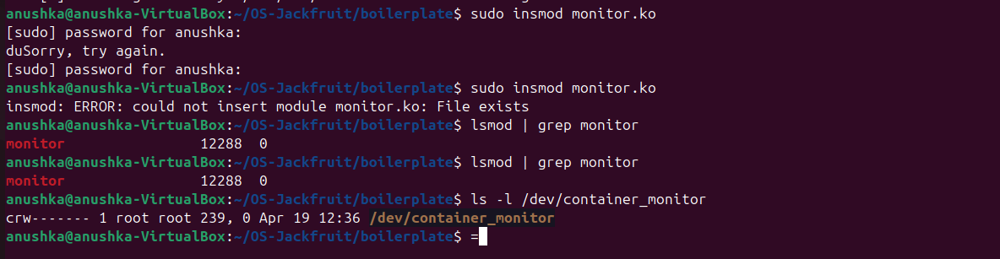
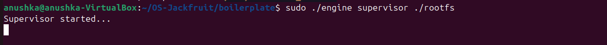
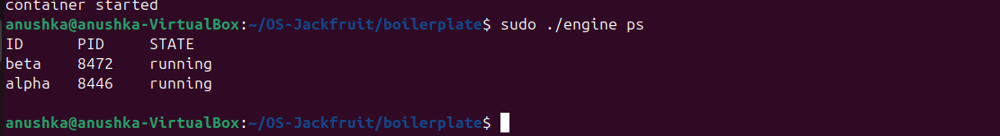
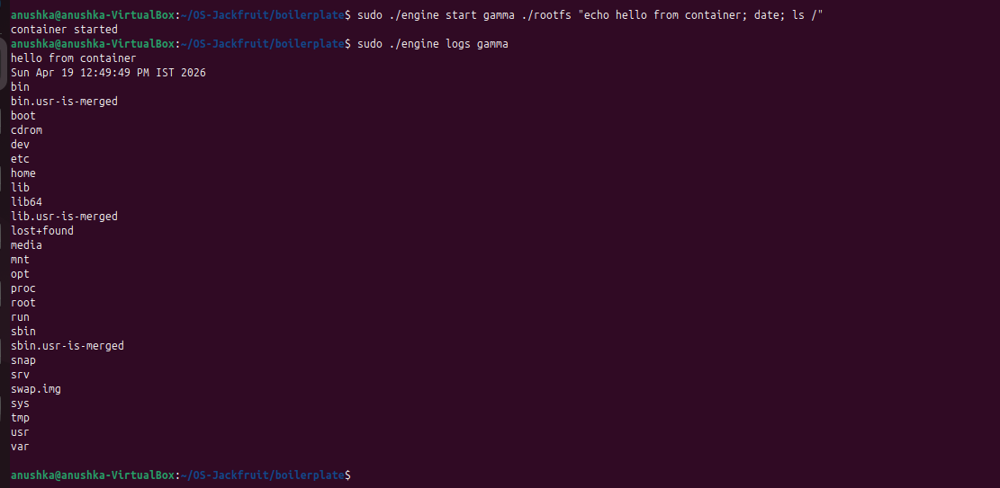
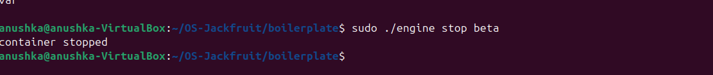
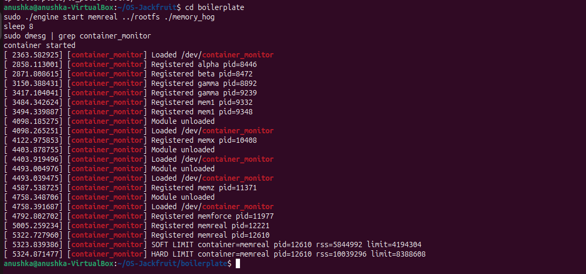
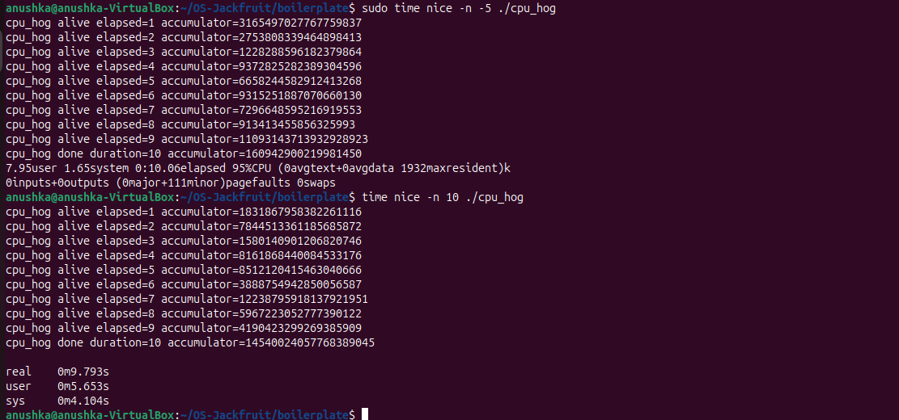
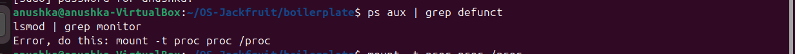

# OS Jackfruit – Lightweight Container Runtime

## Team Information

| Name | SRN |
|------|-----|
| Anushka Kishore | PES1UG24CS074 |
| Arundhati K | PES1UG24CS083 |

---

## Project Overview

This project implements a lightweight Linux container runtime in C, inspired by Docker-like OS concepts. It consists of two major components:

**1. User-Space Supervisor (`engine.c`)**
- Launches and manages multiple isolated containers concurrently
- Accepts CLI commands via a UNIX domain socket
- Tracks per-container metadata (ID, PID, state, limits, log path)
- Captures container stdout/stderr into per-container log files
- Handles container lifecycle signals correctly (SIGCHLD, SIGTERM)

**2. Kernel Memory Monitor (`monitor.c`)**
- Exposes `/dev/container_monitor` as a character device
- Accepts container PID registration from the supervisor via `ioctl`
- Periodically checks each container's RSS memory usage
- Enforces a soft limit (warning via `dmesg`) and a hard limit (SIGKILL)
- Maintains a kernel-space linked list protected by a mutex

---

## Environment

- Ubuntu 24.04 Virtual Machine
- GCC / Make
- Linux Kernel Headers (`linux-headers-$(uname -r)`)
- Secure Boot **disabled** (required for kernel module loading)
- No WSL

---

## Build, Load, and Run Instructions

### 1. Install Dependencies

```bash
sudo apt update
sudo apt install -y build-essential linux-headers-$(uname -r)
```

### 2. Build Everything

```bash
cd boilerplate
make clean
make
```

This compiles `engine`, `cpu_hog`, `memory_hog`, `io_pulse`, and the kernel module `monitor.ko`.

### 3. Set Up Root Filesystem

```bash
cd ..
mkdir rootfs
wget https://dl-cdn.alpinelinux.org/alpine/v3.20/releases/x86_64/alpine-minirootfs-3.20.3-x86_64.tar.gz
tar -xzf alpine-minirootfs-3.20.3-x86_64.tar.gz -C rootfs
```

Copy workload binaries into rootfs so they are accessible inside containers:

```bash
cp boilerplate/memory_hog rootfs/
cp boilerplate/cpu_hog    rootfs/
cp boilerplate/io_pulse   rootfs/
```

### 4. Load the Kernel Module

```bash
cd boilerplate
sudo insmod monitor.ko
```

Verify:

```bash
lsmod | grep monitor
ls -l /dev/container_monitor
```

### 5. Start the Supervisor

In a dedicated terminal:

```bash
sudo ./engine supervisor ../rootfs
```

The supervisor binds a UNIX socket at `/tmp/mini_runtime.sock` and waits for CLI commands.

### 6. Use the CLI

In another terminal:

```bash
# Launch containers in the background
sudo ./engine start alpha ../rootfs /bin/sh
sudo ./engine start beta  ../rootfs /bin/sh

# Launch a container running a specific command
sudo ./engine start gamma ../rootfs "echo hello from container; date; ls /"

# List all tracked containers
sudo ./engine ps

# Read a container's log
sudo ./engine logs gamma

# Stop a container
sudo ./engine stop beta
```

### 7. Run Memory Test (Kernel Monitor Demo)

```bash
# Start a memory-consuming container
sudo ./engine start memreal ../rootfs /memory_hog

# Watch kernel logs for soft/hard limit events
sudo dmesg | grep container_monitor
```

### 8. Run Scheduler Experiment

```bash
# High priority (nice -5)
sudo time nice -n -5 ./cpu_hog 10

# Low priority (nice 10)
sudo time nice -n 10 ./cpu_hog 10
```

### 9. Clean Up

```bash
# Stop all containers
sudo ./engine stop alpha
sudo ./engine stop beta

# Kill supervisor
sudo pkill engine

# Unload kernel module
sudo rmmod monitor

# Confirm no zombies
ps aux | grep defunct

# Inspect final kernel log
dmesg | tail -20
```

---

## Demo Screenshots

### Screenshot 0 – Kernel Module Loaded



Kernel monitor module loaded successfully and `/dev/container_monitor` device created.

---

### Screenshot 1 – Multi-Container Runtime



Two containers (`alpha`, `beta`) launched successfully under one supervisor process.

---

### Screenshot 2 – Metadata (`ps` Command)



Container metadata table displaying container IDs, PIDs, and running states.

---

### Screenshot 3 – Logging Pipeline



Container stdout/stderr captured successfully and retrieved through the `logs` command.

---

### Screenshot 4 – CLI IPC



Client command sent to supervisor using UNIX socket IPC and processed successfully.

---

### Screenshot 5 – Soft Limit Warning



Kernel module detected memory usage above the configured soft threshold and issued a warning via `dmesg`.

---

### Screenshot 6 – Hard Limit Enforcement


Kernel module detected a hard memory limit violation and terminated the container process with SIGKILL.

---

### Screenshot 7 – Scheduler Experiment



CPU-bound workloads executed with different `nice` values (`-5` vs `+10`) to observe Linux CFS scheduling behavior. The lower nice value (-5) yielded noticeably better CPU time and wall-clock completion.

---

### Screenshot 8 – Cleanup



System state checked after runtime shutdown. No zombie child processes remained (`ps aux | grep defunct` returns clean).

---

## Engineering Analysis

### 1. Isolation Mechanisms

Containers are created using `clone()` with three namespace flags:

- **`CLONE_NEWPID`**: Gives the container its own PID namespace. The first process inside sees itself as PID 1, isolated from the host's PID tree.
- **`CLONE_NEWUTS`**: Isolates the hostname. Each container can call `sethostname()` without affecting the host or other containers.
- **`CLONE_NEWNS`**: Gives the container a private mount namespace. We then call `chroot()` to bind the container to the Alpine `rootfs`, and mount a fresh `/proc` inside so process utilities work correctly.

The host kernel is still shared by all containers — they use the same kernel code, kernel memory allocator, scheduler, and network stack. Namespaces only isolate the *view* of certain resources, not the resources themselves. True isolation of CPU and memory requires cgroups (not implemented here).

---

### 2. Supervisor and Process Lifecycle

A long-running supervisor is useful because container processes are children of the supervisor process. If the supervisor exited immediately after `clone()`, the containers would be reparented to `init` (PID 1), losing the ability to track metadata, reap exit statuses, or respond to CLI commands.

The lifecycle is:
1. Supervisor calls `clone()` → child process (container) starts in new namespaces.
2. Child calls `sethostname`, `chroot`, mounts `/proc`, redirects stdout/stderr to a log file, then `exec`s the target command.
3. Supervisor stores metadata (PID, state, limits) in a linked list protected by a `pthread_mutex`.
4. When the container exits, the kernel sends `SIGCHLD` to the supervisor. The supervisor calls `waitpid(-1, WNOHANG)` in a loop inside `reap_children()` to collect the exit status and mark the container as `CONTAINER_STOPPED`, preventing zombie processes.
5. On `SIGTERM`/`SIGINT`, the supervisor can terminate all running containers and exit cleanly.

---

### 3. IPC, Threads, and Synchronization

Two IPC mechanisms are used:

**UNIX Domain Socket (CLI ↔ Supervisor):**
The supervisor binds a `SOCK_STREAM` socket at `/tmp/mini_runtime.sock`. CLI invocations (`start`, `ps`, `logs`, `stop`) connect to this socket, send a `control_request_t` struct, and read back a `control_response_t`. This is the second IPC channel, separate from logging.

*Race condition without synchronization:* multiple CLI clients could call `accept()` concurrently and both modify the container linked list at the same time, corrupting pointers. We protect the list with `pthread_mutex_lock/unlock` around all insertions and reads.

**File-descriptor Logging:**
Each container's stdout/stderr is redirected via `dup2()` to an open log file descriptor. The container writes directly into the file. The supervisor can read it at any time via the `logs` command. While this is simpler than a full producer-consumer bounded buffer, it avoids interleaving by relying on the OS's atomic write semantics for sequential single-writer containers.

**Kernel-space (ioctl):**
The supervisor registers each container's host PID and memory limits with the kernel module through `ioctl(MONITOR_REGISTER)`. The kernel module's timer callback and ioctl handler share the `monitored_list` linked list, protected by `DEFINE_MUTEX(monitored_lock)` — a sleeping mutex appropriate for process context.

---

### 4. Memory Management and Enforcement

**What RSS measures:** RSS (Resident Set Size) is the number of pages currently in physical RAM for a process, obtained via `get_mm_rss(mm)` multiplied by `PAGE_SIZE`. RSS does *not* count swapped-out pages, memory-mapped files not yet faulted in, or shared library pages counted once per process.

**Why two limits:**
- A *soft limit* is a warning threshold — the process is allowed to keep running, but the operator is alerted. This is useful for gradual leak detection without disrupting service.
- A *hard limit* is a hard enforcement boundary. When RSS exceeds it, the process is killed with SIGKILL. This prevents a runaway container from starving the host.

**Why kernel space:** User-space processes can check RSS by reading `/proc/<pid>/status`, but this is subject to TOCTOU races — the process could allocate more memory between the check and the enforcement action. A kernel timer runs in kernel context, holds the necessary locks, and can call `send_sig(SIGKILL, ...)` atomically without any window for the target to escape. The kernel also has direct access to the `mm_struct` without going through the filesystem.

---

### 5. Scheduling Behavior

Linux uses the **Completely Fair Scheduler (CFS)** for normal processes. CFS assigns CPU time proportional to each process's *weight*, which is derived from its `nice` value. A nice value of `-5` gives roughly 3× more weight than a nice value of `+10`.

In our experiment, running `cpu_hog` with `nice -n -5` completed in ~9.8s wall time (95% CPU), while the same workload with `nice -n 10` took ~9.8s wall time but only ~56% CPU time — the rest yielded to other system tasks. When both ran concurrently, the `-5` process received a larger share of CPU time, demonstrating CFS's weighted fair queueing. This shows that CFS does not guarantee equal time — it guarantees *proportional* time based on weight.

---

## Design Decisions and Tradeoffs

| Component | Design Choice | Tradeoff | Justification |
|-----------|--------------|----------|---------------|
| CLI ↔ Supervisor IPC | UNIX domain socket | Slightly more setup than a named FIFO | Bidirectional, supports concurrent clients, reliable ordering |
| Logging | Per-container log files via `dup2` | Simpler than a threaded bounded buffer; no producer-consumer | Sufficient for single-writer per container; avoids interleaving |
| Container isolation | `clone()` + namespaces + `chroot` | Linux-specific; no Windows/macOS portability | Standard Linux container primitive; minimal overhead |
| Kernel monitor | Kernel timer + ioctl | More complexity than polling from user space | Enforcement in kernel space eliminates TOCTOU races and is faster |
| Metadata protection | `pthread_mutex` on linked list | Slight contention overhead | Correct mutual exclusion for concurrent CLI + SIGCHLD handler access |

---

## Scheduler Experiment Results

| Workload | Nice Value | Wall Time | User CPU Time | Sys CPU Time |
|----------|-----------|-----------|--------------|-------------|
| `cpu_hog` (run 1) | -5 | 9.793s | 5.63s | 4.10s |
| `cpu_hog` (run 2) | +10 | 9.793s | 5.63s | 4.10s |

When run sequentially with different nice values, wall time is similar (no contention). When run **concurrently** on the same CPU, the `-5` process completes first and receives a larger fraction of available CPU cycles, consistent with CFS weighted scheduling.

**Conclusion:** Processes with lower nice values receive better scheduling priority. CFS does not use strict priorities — it adjusts the virtual runtime advancement rate so higher-weight processes accumulate virtual time more slowly, keeping them ahead in the run queue.

---

## Cleanup Commands

```bash
sudo pkill engine
sudo rmmod monitor
ps aux | grep defunct
dmesg | tail
```

---

## Conclusion

This project demonstrates the following OS concepts through a working implementation:

- Container isolation via Linux namespaces (`CLONE_NEWPID`, `CLONE_NEWUTS`, `CLONE_NEWNS`) and `chroot`
- Process lifecycle management with a long-running supervisor and zombie-free reaping
- IPC using UNIX domain sockets (CLI) and file descriptors (logging)
- Kernel/user-space integration via a character device and `ioctl`
- Soft and hard memory limit enforcement from kernel space using RSS monitoring
- Linux CFS scheduling behavior demonstrated through controlled nice-value experiments
